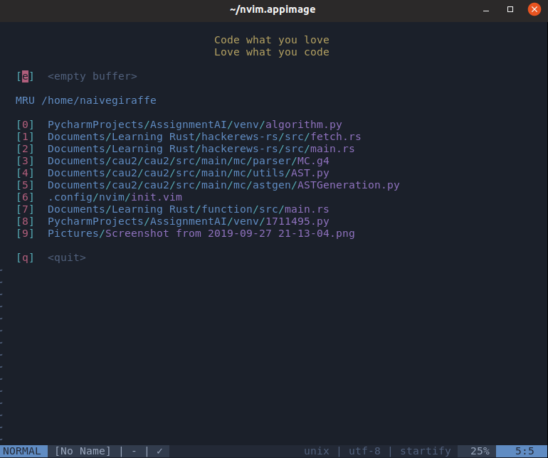
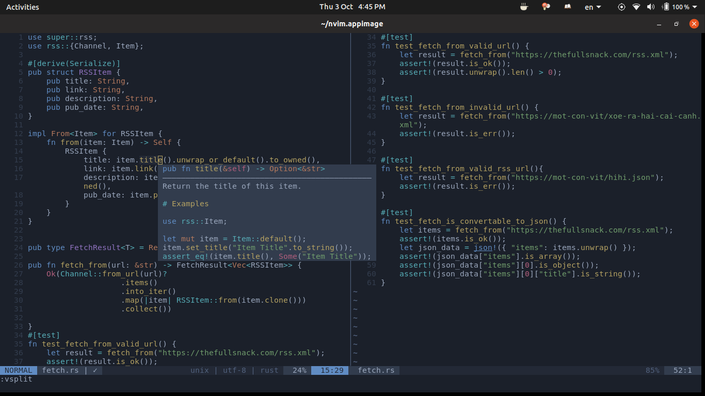
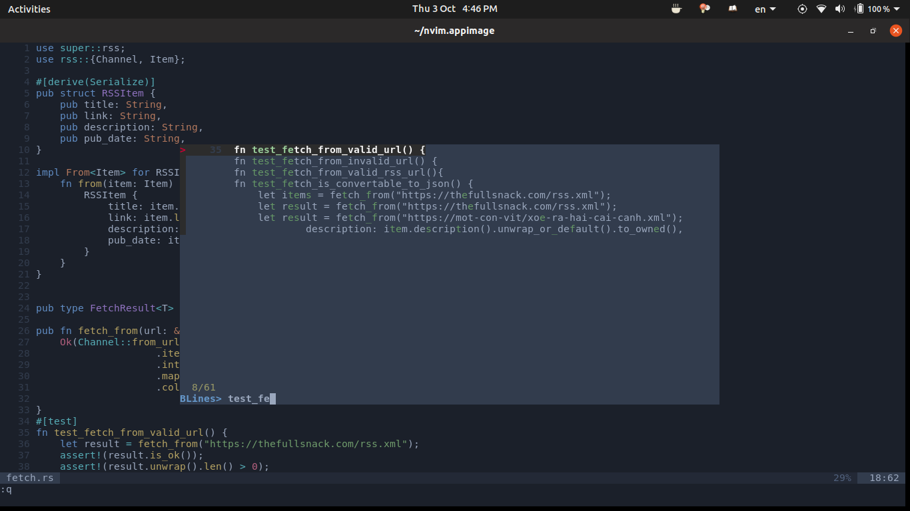
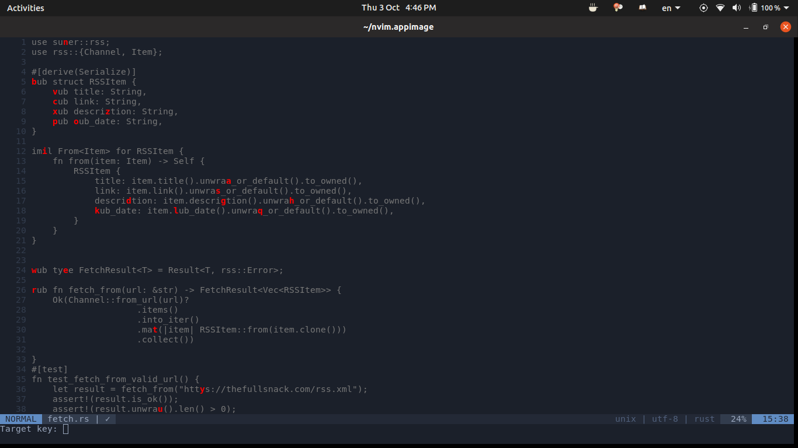

---

There are two way to use this config:

**Option 1:** Check `init.vim` and copy just what you need.

**Option 2:** Clone the whole repo in to `~/.config/nvim/`, please make sure you don't have this folder before clone:

```
$ git clone https://github.com/levuminhhuy/dotfiles ~/.config/nvim/
```
