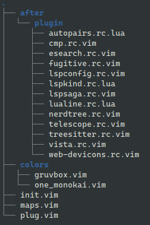
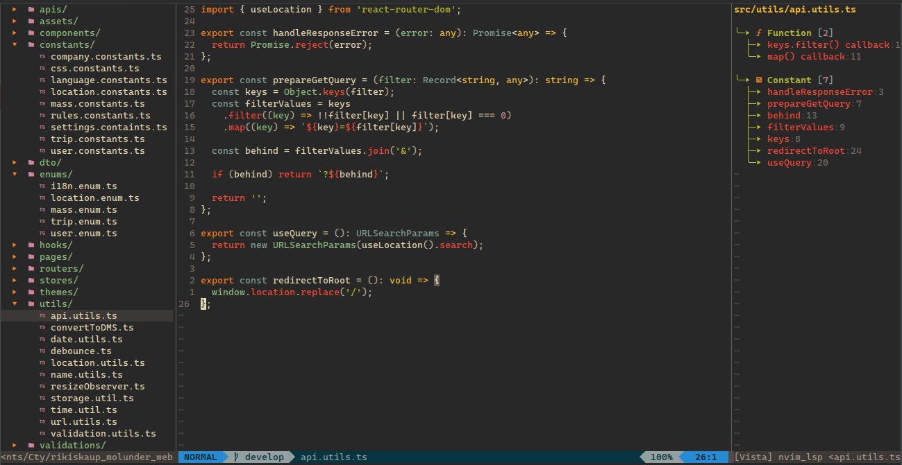
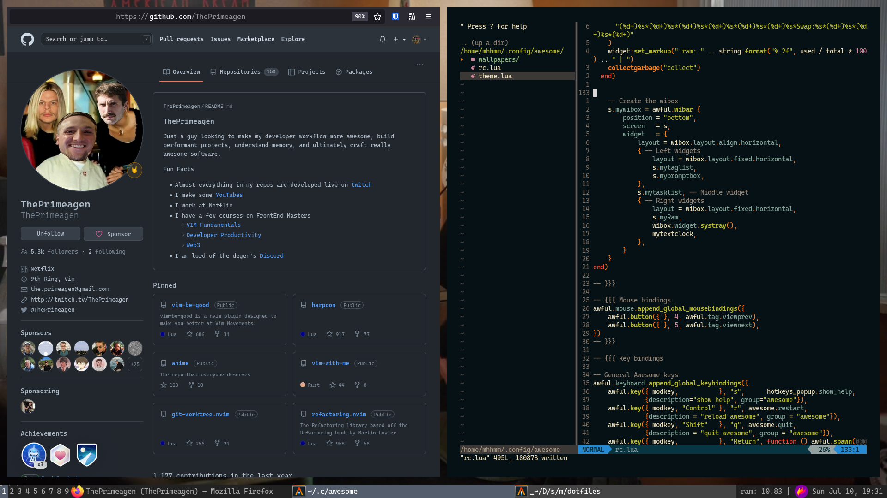
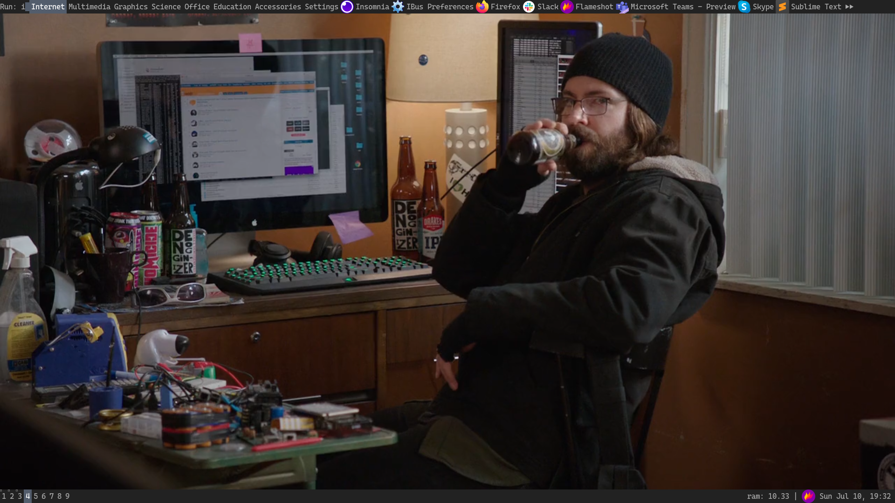

ut these files into `$HOME/.config`

### Fish


Simple prompt UI config by me

Remember to install `exa` for better list files.

Run these command:

```
set fish_gretting "code what you love, love what you code"
set fish_color_valid_path
fish_config
```

Choose the colors in that config site

### Nvim



Remember to install `vim-plug` and run :PlugInstall inside `$HOME/.config/nvim/plug.vim`

Theme: Gruvbox
Font: Cascadia Code Roman



### Awesomewm

I use Arch, btw

My first rice looks like the picture below with a lot complicated stuffs and features.

[comment]: <> 

[comment]: <> 
[comment]: <> 

After a while, I found this rice has many problems (slow by the time, so much functions that I don't understand and therefore can not control it)

I decided to turn back to the basic, with have nothing than just a default config.




Please install font: Cascadia Code Nerd Font, I love this font so much
