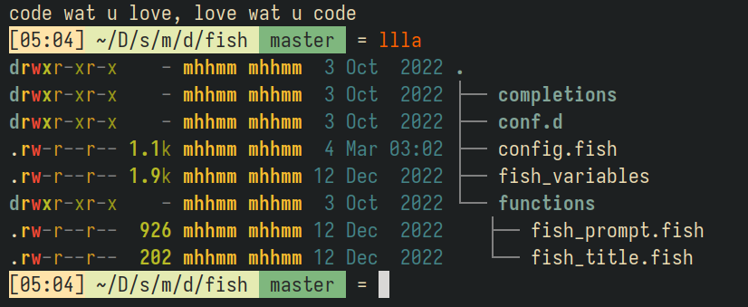

Put these files into `$HOME/.config`

### Fish



Simple prompt UI config by me

Remember to install `exa` for better list files.

Run these command:

```
set fish_gretting "code what you love, love what you code"
set fish_color_valid_path
fish_config
```

### Nvim

Remember to install `vim-plug` and run :PlugInstall inside `$HOME/.config/nvim/plug.vim`

Install copilot for nvim

```
git clone https://github.com/github/copilot.vim.git \
  ~/.config/nvim/pack/github/start/copilot.vim
```


### Awesomewm

I use Arch, btw

I decided to turn back to the basic, which have nothing than just a default config.

and some reminder stuffs i custom in the wibar (e.g. todolist, count down to workout time, get realtime twitch live, pomodoro, water reminder, do not disturb options, ...)


