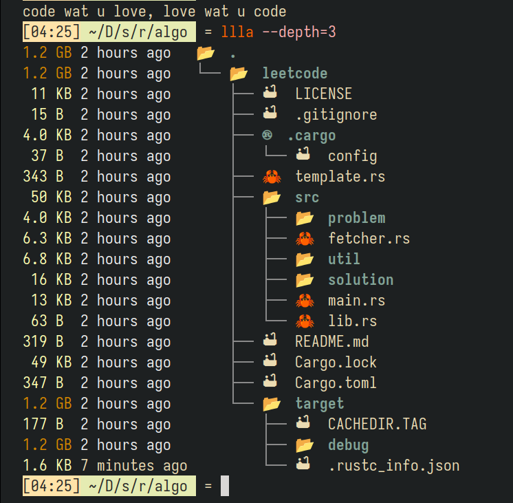
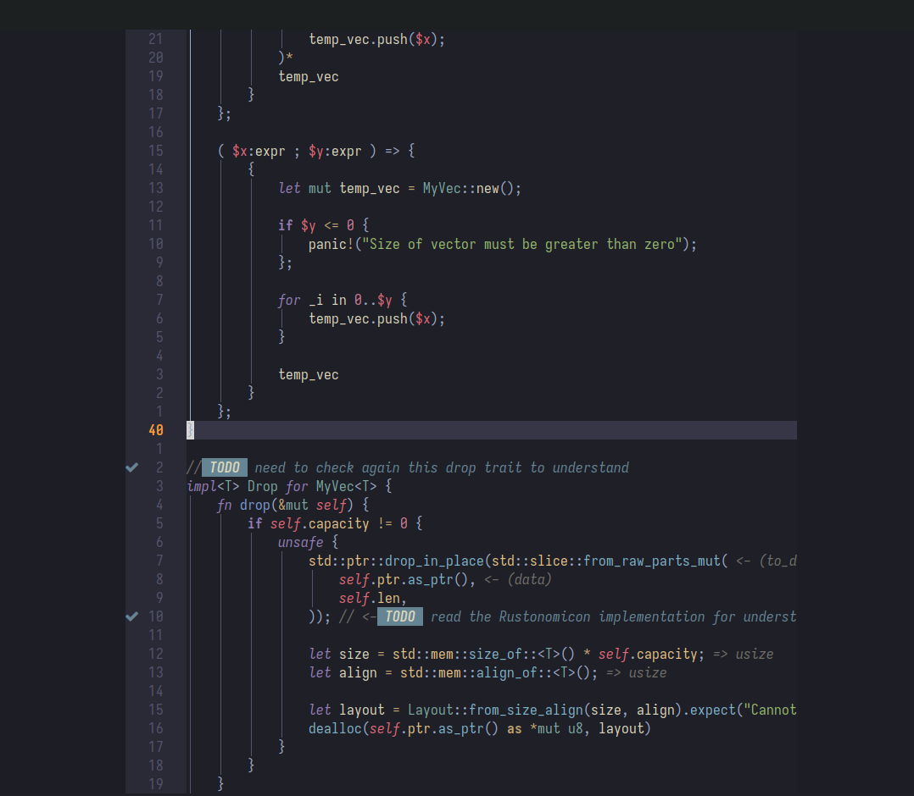
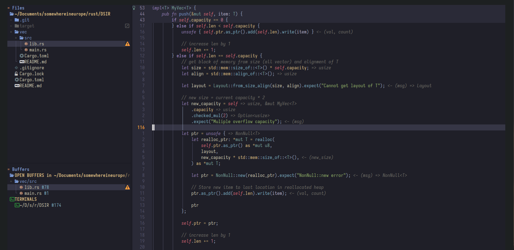

Put these files into `$HOME/.config`

### Fish



Simple prompt UI config by me

I switched from `exa` to `lsd` for better listing folder size

Run these command:

```
set fish_gretting "code what you love, love what you code"
set fish_color_valid_path
fish_config
```

### Nvim

2024 is coming, time to use LazyVim

also _hasta la vista_ Copilot, I'm with Codium now, free and simple enough !




### Awesomewm

I use Arch, btw

I decided to turn back to the basic, which have nothing than just a default config.

and some reminder stuffs i custom in the wibar (e.g. todolist, count down to workout time, get realtime twitch live, pomodoro, water reminder, do not disturb options, ...)


